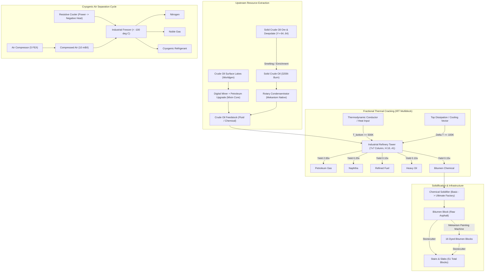
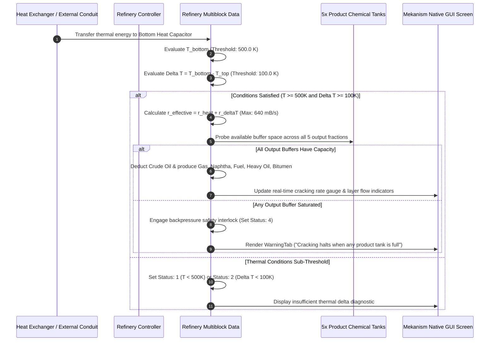

# Mekanism: Complex Industries (Petroleum & Cryogenic Ecology)

[English](README.md) | [简体中文](README_zh.md)

[](LICENSE)
[](https://openjdk.org/)
[](https://www.minecraft.net/)
[](https://neoforged.net/)
[](https://github.com/mekanism/Mekanism)

**Mekanism: Complex Industries (MCI)** is an industrial-scale expansion add-on engineered for [Mekanism](https://github.com/mekanism/Mekanism) on Minecraft 1.21.1 (NeoForge). It introduces a closed-loop **petroleum harvesting, thermal cracking, cryogenic separation, and chemical solidification** production ecology. Designed with strict fidelity to Mekanism's native aesthetics and architectural design principles, MCI seamlessly expands mid-to-endgame industrial infrastructure.

The mod features two modular multiblock structures: the **Industrial Refinery Tower** (a 7×7 diamond-footprint fractional distillation column driven by thermodynamic gradients) and the **Industrial Freezer** (a sub-100°C cryogenic distillation vault). Coupled with **runtime Mixin bytecode injection** for automated fluid extraction via the Digital Miner, a 4-tier scalable **Chemical Solidifier Factory** system, and a 51-block modular roadway construction matrix, MCI establishes a rigorous, production-grade petrochemical workflow.

---

## Table of Contents

- [Industrial Architecture & Processing Topology](#industrial-architecture--processing-topology)
- [Core Subsystems Reference](#core-subsystems-reference)
  - [1. Industrial Refinery Tower (Fractional Distillation Column)](#1-industrial-refinery-tower-fractional-distillation-column)
  - [2. Industrial Freezer & Cryogenic Separation](#2-industrial-freezer--cryogenic-separation)
  - [3. Chemical Solidification & 4-Tier Factory Infrastructure](#3-chemical-solidification--4-tier-factory-infrastructure)
  - [4. Digital Miner Petroleum Harvesting (Mixin Integration)](#4-digital-miner-petroleum-harvesting-mixin-integration)
  - [5. High-Durability Bitumen Infrastructure & Road Ecology](#5-high-durability-bitumen-infrastructure--road-ecology)
  - [6. Dual Recipe Viewer Engines (JEI & EMI)](#6-dual-recipe-viewer-engines-jei--emi)
- [Auxiliary Engineering Documentation](#auxiliary-engineering-documentation)
- [Quick Start & Build Guide](#quick-start--build-guide)
- [Repository Structure](#repository-structure)
- [License](#license)

---

## Industrial Architecture & Processing Topology

The industrial topology encompasses raw resource discovery, fluid extraction, high-temperature thermal cracking, sub-ambient distillation, and material fabrication:



### Thermodynamic Cracking & Safety Interlock Sequence



---

## Core Subsystems Reference

### 1. Industrial Refinery Tower (Fractional Distillation Column)
The **Industrial Refinery Tower (IRT)** is a vertical column engineered for continuous fractional distillation:
- **Geometry**: 7×7 diamond cross-section (25 active blocks per layer), variable height between **16 and 41 blocks**.
- **Internal Partitioning**: 4 structural partition floors isolate 5 vertical chambers corresponding to the 5 cracking fractions.
- **Thermodynamic Drive**: Requires bottom heating ($T_{\text{bottom}} \ge 500\text{ K}$) and a vertical thermal gradient ($\Delta T \ge 100\text{ K}$). Cracking scales up to **$640\text{ mB/s}$** ($32\text{ mB/tick}$).
- **Dynamic Valve Routing**: Refinery Valves automatically bind to the output chemical of their corresponding Y-level layer, featuring real-time texture feedback and Configurator mode switching.
- **Hazard Containment**: Active mob spawn suppression eliminates entity generation within the tower and its immediate perimeter.

### 2. Industrial Freezer & Cryogenic Separation
The **Industrial Freezer** is a high-volume cryogenic processing vault:
- **Geometry**: Scalable cubic enclosure ranging from $4\times 4\times 4$ to $8\times 8\times 8$.
- **Operating Requirement**: Internal temperature must be driven below **$-100.0^\circ\text{C}$ ($173.15\text{ K}$)**.
- **Cryogenic Products**: Liquefies and fractionates Compressed Air into **Nitrogen**, **Noble Gas**, and **Cryogenic Refrigerant**.
- **Resistive Cooler Integration**: Directly accepts negative thermal transfer from the Resistive Cooler to sustain cryogenic temperatures under thermal load.

### 3. Chemical Solidification & 4-Tier Factory Infrastructure
The **Chemical Solidifier** executes the phase transformation of gases and liquid chemicals into solid blocks and items:
- **Scalable Factory Tiers**: Fully supports Mekanism's factory progression:
  - **Basic Factory**: 3 parallel processing channels
  - **Advanced Factory**: 5 parallel processing channels
  - **Elite Factory**: 7 parallel processing channels
  - **Ultimate Factory**: 9 parallel processing channels
- **Upgrade Support**: Accepts Speed Upgrades, Energy Upgrades, and Muffler Upgrades with native inventory auto-sorting.

### 4. Digital Miner Petroleum Harvesting (Mixin Integration)
MCI extends Mekanism's Digital Miner through targeted bytecode injection:
- **Petroleum Harvesting Upgrade**: Dynamically injected into Mekanism's native `Upgrade` enum via Mixin.
- **Filterless Fluid Mining**: When installed, the miner scans and collects crude oil source blocks within its operational radius without requiring item/tag filter configuration.

### 5. High-Durability Bitumen Infrastructure & Road Ecology
A comprehensive architectural material suite manufactured from solidified Bitumen:
- **51 Distinct Variants**: 1 raw dark bitumen + 16 dyed colors (White, Orange, Magenta, Light Blue, Yellow, Lime, Pink, Gray, Light Gray, Cyan, Purple, Blue, Brown, Green, Red, Black).
- **Architectural Profiles**: Each color includes **Full Blocks**, **Stairs**, and **Slabs**.
- **Factory Recolor Integration**: Compatible with the Mekanism Painting Machine for rapid chemical recoloring, and Vanilla Stonecutter for zero-waste shape fabrication.

### 6. Dual Recipe Viewer Engines (JEI & EMI)
MCI includes native plugins for major recipe viewers:
- **Just Enough Items (JEI)**: Custom categories with thermodynamic temperature requirements, operational consumption, and warning descriptions.
- **EMI Recipe Viewer**: Native EMI NeoForge plugin featuring animated progress bars, live chemical fluid gauges, and factory tier power analytics.

---

## Auxiliary Engineering Documentation

Detailed technical breakdowns and developer protocols are available in the [`docs/`](docs/) directory:

| Document | Description | Focus Area |
| :--- | :--- | :--- |
| [**Refinery Architecture Specification**](docs/REFINERY_ARCHITECTURE.md) | Voxel layouts, partition math, thermodynamic equations, and valve binding. | Multiblock Mechanics |
| [**Petrochemical Process Ecology**](docs/PETROCHEMICAL_ECOLOGY.md) | Stoichiometric reaction balances, worldgen rates, and factory scaling. | Chemical Process Engineering |
| [**Agent Collaboration SOP**](docs/AGENT_WORKFLOW.md) | AI Agent engineering workflow, reverse-engineering protocols, and headless QA. | Engineering Standards |
| [**Developer & Modder Guide**](docs/DEVELOPMENT.md) | Development setup, DeferredRegister taxonomy, Mixin architecture, and packets. | Codebase & Contribution |

---

## Quick Start & Build Guide

### Prerequisites
- **Java Development Kit (JDK)**: Version 21 (managed via Gradle Toolchain)
- **Minecraft**: 1.21.1
- **NeoForge**: 21.1.200 or newer
- **Mekanism Core**: 1.21.1-10.7.19.85

### Building from Source

```bash
# Clone repository
git clone https://github.com/TianYaYou/Mekanism-Complex-Industries.git
cd Mekanism-Complex-Industries

# Compile and package jar
./gradlew build
```

Compiled mod artifacts are generated in `build/libs/`.

### Development & Headless Verification

```bash
# Launch development client with mod loaded
./gradlew runClient

# Execute headless GameTest regression suite
./gradlew runGameTestServer

# One-click hot deployment to local test modpack
./gradlew deployToModpack
```

> **Note**: Configure `modpack_mods_dir` in `gradle.properties` to target your local test modpack folder.

---

## Repository Structure

```text
Mekanism-Complex-Industries/
├── .github/
│   ├── ISSUE_TEMPLATE/                   # Bug report and feature request templates
│   └── pull_request_template.md          # Standardized PR checklist
├── docs/
│   ├── AGENT_WORKFLOW.md                 # Agent engineering workflow & SOP
│   ├── DEVELOPMENT.md                    # Developer guide & technical taxonomy
│   ├── REFINERY_ARCHITECTURE.md          # IRT structural blueprint & thermodynamics
│   └── PETROCHEMICAL_ECOLOGY.md          # Stoichiometry, worldgen, and factory scaling
├── src/main/java/com/complexindustries/mekanism/
│   ├── MekanismComplexIndustries.java    # Mod lifecycle entry point
│   ├── MCIConstants.java                 # Mod constants and ResourceLocation utilities
│   ├── client/                           # GUI screens, models, and render layers
│   ├── content/
│   │   ├── block/                        # Block definitions & decorative bitumen blocks
│   │   ├── fluid/                        # Crude Oil & Refrigerant fluid types
│   │   ├── freezer/                      # Industrial Freezer multiblock data & validator
│   │   ├── refinery/                     # IRT multiblock, spawn suppression & kinetics
│   │   ├── solidifier/                   # Chemical Solidifier & 4-tier factory tiles
│   │   ├── tile/                         # Air Compressor & Resistive Cooler tile entities
│   │   └── upgrade/                      # Petroleum Harvesting upgrade mechanics
│   ├── mixin/                            # Mixin bytecode hooks for Mekanism systems
│   ├── network/                          # Custom network packet handlers
│   ├── recipe/                           # Chemical Solidifier custom recipe serializing
│   ├── registration/                     # DeferredRegister registries
│   └── test/                             # GameTest automated verification framework
├── src/main/resources/
│   ├── META-INF/neoforge.mods.toml       # NeoForge metadata descriptor
│   ├── assets/mekanism_complex_industries/
│   │   ├── lang/                         # Bilingual localization (en_us, zh_cn)
│   │   ├── models/ & textures/           # Models, blockstates, and animated textures
│   └── data/mekanism_complex_industries/ # Recipes, loot tables, and worldgen JSONs
├── build.gradle                          # NeoForge ModDev build configuration
├── gradle.properties                     # Version coordinates and JVM parameters
├── settings.gradle                       # Repository mirror configuration
├── CHANGELOG.md                          # Release history and version change notes
├── CONTRIBUTING.md                       # Contribution protocols and PR workflow
├── CODE_OF_CONDUCT.md                    # Community code of conduct
└── LICENSE                               # MIT License
```

---

## License

This project is licensed under the **MIT License**. See the [LICENSE](LICENSE) file for details.
