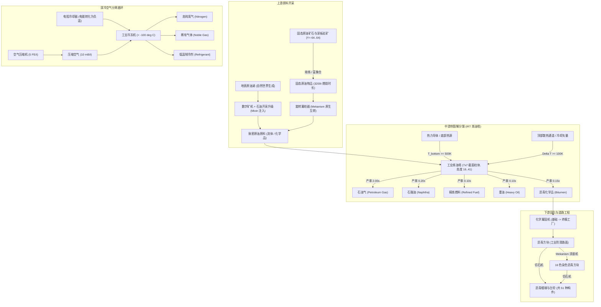
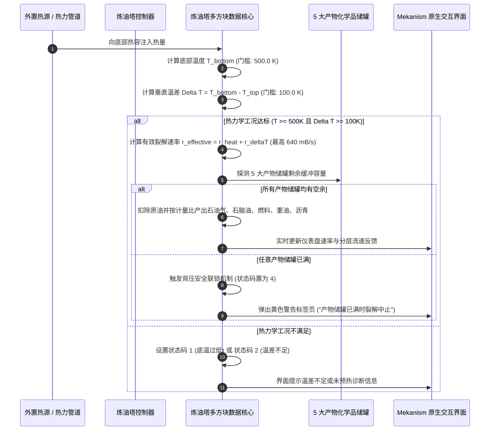

# Mekanism: Complex Industries (石油化工与低温生态)

[English](README.md) | [简体中文](README_zh.md)

[](LICENSE)
[](https://openjdk.org/)
[](https://www.minecraft.net/)
[](https://neoforged.net/)
[](https://github.com/mekanism/Mekanism)

**Mekanism: Complex Industries (MCI)** 是专为 Minecraft 1.21.1 (NeoForge) 平台上的 [Mekanism](https://github.com/mekanism/Mekanism) 打造的重工业级拓展模组。它引入了一套完整的**原油开采、热裂解精馏、低温气体分离与化学品固化**化工生产链。模组在视觉美学、交互规范与底层架构上严格对齐 Mekanism 原版标准，为工业工程师提供工业感扎实的中后期生产线。

模组包含两大核心多方块结构：**工业炼油塔（Industrial Refinery Tower）**（基于 7×7 菱形截面、由垂直热力学温差驱动的高温分馏柱）与**工业冷冻机（Industrial Freezer）**（低于 -100°C 的深冷低温分馏腔室）。辅以基于 **Mixin 字节码动态注入**的数字矿机原油免过滤自动开采、4 级可扩展**化学凝固机工厂（Chemical Solidifier Factory）**体系，以及包含 51 种构件的工业级沥青路面建设矩阵，构建起一套严谨、自洽的现代石化工程体系。

---

## 目录

- [工业架构与流程拓扑](#工业架构与流程拓扑)
- [核心子系统详解](#核心子系统详解)
  - [1. 工业炼油塔 (分馏精馏塔多方块)](#1-工业炼油塔-分馏精馏塔多方块)
  - [2. 工业冷冻机与深冷分离循环](#2-工业冷冻机与深冷分离循环)
  - [3. 化学品凝固与 4 级工厂架构](#3-化学品凝固与-4-级工厂架构)
  - [4. 数字矿机石油开采升级 (Mixin 运行时注入)](#4-数字矿机石油开采升级-mixin-运行时注入)
  - [5. 高耐久沥青道路生态 (51 种建筑构件)](#5-高耐久沥青道路生态-51-种建筑构件)
  - [6. 双配方查看器原生支持 (JEI 与 EMI)](#6-双配方查看器原生支持-jei-与-emi)
- [扩展工程与开发文档](#扩展工程与开发文档)
- [快速上手与构建指南](#快速上手与构建指南)
- [仓库目录结构](#仓库目录结构)
- [开源协议](#开源协议)

---

## 工业架构与流程拓扑

整个生产拓扑覆盖了地表与地下资源勘探、流体提取、高温热裂解、深冷蒸馏与固态工程材料制备：



### 热力学裂解与安全联锁时序流



---

## 核心子系统详解

### 1. 工业炼油塔 (分馏精馏塔多方块)
**工业炼油塔（Industrial Refinery Tower）**是用于原油高温连续裂解的大型立式分馏塔：
- **结构几何**：7×7 菱形截面（每层占用 25 个有效方块），高度可在 **16 至 41 方块** 之间自由定制。
- **分层隔板**：塔身内部由 4 层隔板物理隔离出 5 个垂直气液分离室，对应 5 级蒸馏馏分。
- **热力学驱动**：依赖底部加热（$T_{\text{bottom}} \ge 500\text{ K}$）与垂直温度梯度（$\Delta T \ge 100\text{ K}$），裂解速率线性跃升至最高 **$640\text{ mB/s}$**（$32\text{ mB/tick}$）。
- **动态阀门路由**：炼油阀门根据所在 Y 轴高度自动绑定对应产物层化学品，支持材质动态变色反馈与配置器一键切换输入/输出。
- **安全与环境防护**：内置生物生成抑制机制，彻底消除塔身内部及周边安全缓冲带内的刷怪隐患。

### 2. 工业冷冻机与深冷分离循环
**工业冷冻机（Industrial Freezer）**是用于超低温气体分离的密闭冷冻结构：
- **结构几何**：$4\times 4\times 4$ 至 $8\times 8\times 8$ 的可扩展立方体结构。
- **深冷工况**：内部温度必须降至 **$-100.0^\circ\text{C}$ ($173.15\text{ K}$)** 以下方可激活工作循环。
- **深冷产物**：将空气压缩机生成的压缩空气深度液化并分馏为**高纯氮气**、**稀有气体**与**低温制冷剂**。
- **电阻冷却器配合**：可与单方块**电阻冷却器**直接热互联，通过消耗电能持续抽取热量维持深冷环境。

### 3. 化学品凝固与 4 级工厂架构
**化学凝固机（Chemical Solidifier）**用于将气体与液相化学品相变固化为实体方块或工业物品：
- **完整的 4 级工厂升级树**：全面继承 Mekanism 原版工厂升级体系：
  - **基础工厂（Basic Factory）**：3 通道并行处理
  - **高级工厂（Advanced Factory）**：5 通道并行处理
  - **精英工厂（Elite Factory）**：7 通道并行处理
  - **终极工厂（Ultimate Factory）**：9 通道并行处理
- **插件槽位与自动整理**：全面兼容速度、能量与消音升级插件，搭载网络同步输出物品自动整理。

### 4. 数字矿机石油开采升级 (Mixin 运行时注入)
MCI 通过 Mixin 字节码注入深度扩充了 Mekanism 数字矿机的能力边界：
- **石油开采升级插件**：动态注入 Mekanism 原生 `Upgrade` 枚举体系。
- **免过滤智能采油**：插入数字矿机后，无需配置复杂的物品/标签过滤器，即可自动扫描并在作业半径内直接抽采所有连通的原油源块。

### 5. 高耐久沥青道路生态 (51 种建筑构件)
以凝固沥青为基础构建的现代重工业路面建筑系统：
- **51 种完整变体**：1 种原始深灰黑工业沥青 + 16 种经典染色变体（白、橙、品红、淡蓝、黄、黄绿、粉、灰、淡灰、青、紫、蓝、棕、绿、红、黑）。
- **完整造型覆盖**：每种颜色均包含**完整方块**、**楼梯**与**台阶**。
- **工厂无损加工**：全面支持放入 Mekanism 涂装机利用染料快速换色，支持在切石机中零损耗裁切造型。

### 6. 双配方查看器原生支持 (JEI 与 EMI)
MCI 为主流配方模组提供了深度适配插件：
- **JEI (Just Enough Items)**：内置炼油裂解、低温分离、空气压缩与化学品凝固 4 大专属类别，显示热力学温度要求、功耗与满罐警告说明。
- **EMI Recipe Viewer**：原生 EMI NeoForge 插件，包含平滑流动化学品材质表、动态箭头动画与分级工厂能耗分析。

---

## 扩展工程与开发文档

更多深层次的机械原理、工程参数与架构规范已整理收录在 [`docs/`](docs/) 目录：

| 文档名称 | 核心内容概述 | 适用方向 |
| :--- | :--- | :--- |
| [**工业炼油塔架构蓝图**](docs/REFINERY_ARCHITECTURE.md) | 7×7 体素网格剖面图、分层隔板计算公式、热力学动力学方程与阀门绑定原理。 | 多方块工程与数值推演 |
| [**石油与深冷工艺生态指南**](docs/PETROCHEMICAL_ECOLOGY.md) | 化学反应计量比、自然世界生成规则、深冷循环平衡与工厂能耗梯级。 | 化工流程设计与平衡 |
| [**Agent 协作研发规范 (SOP)**](docs/AGENT_WORKFLOW.md) | AI Agent 自动化逆向工程规范、无头验证协议与闭环提交标准。 | 自动化工程与代码质量 |
| [**模组开发与架构参考**](docs/DEVELOPMENT.md) | 开发环境构建、NeoForge 注册器总表、Mixin 注入点分析与数据包通信机制。 | 二次开发与代码贡献 |

---

## 快速上手与构建指南

### 环境依赖
- **Java 开发环境 (JDK)**：Java 21（由 Gradle Toolchain 自动管理）
- **Minecraft 版本**：1.21.1
- **NeoForge 版本**：21.1.200 或更高
- **Mekanism 原置**：1.21.1-10.7.19.85

### 从源码编译

```bash
# 克隆仓库
git clone https://github.com/TianYaYou/Mekanism-Complex-Industries.git
cd Mekanism-Complex-Industries

# 编译并打包 Jar
./gradlew build
```

编译产物位于 `build/libs/` 目录下。

### 本地调试与无头验证

```bash
# 启动带有模组的调试客户端
./gradlew runClient

# 运行自动化无头 GameTest 回归测试套件
./gradlew runGameTestServer

# 一键热部署至本地测试整合包
./gradlew deployToModpack
```

> **提示**：可以在 `gradle.properties` 中修改 `modpack_mods_dir` 变量，以指向你的本地测试整合包 mods 目录。

---

## 仓库目录结构

```text
Mekanism-Complex-Industries/
├── .github/
│   ├── ISSUE_TEMPLATE/                   # 缺陷报告与功能建议 Issue 模板
│   └── pull_request_template.md          # 规范化 PR 提交清单
├── docs/
│   ├── AGENT_WORKFLOW.md                 # Agent 工程研发工作流与逆向规范 (SOP)
│   ├── DEVELOPMENT.md                    # 模组开发者手册与架构总表
│   ├── REFINERY_ARCHITECTURE.md          # 工业炼油塔多方块蓝图与热力学方程
│   └── PETROCHEMICAL_ECOLOGY.md          # 流程生态、化学计量比与工厂能耗
├── src/main/java/com/complexindustries/mekanism/
│   ├── MekanismComplexIndustries.java    # 模组生命周期主入口
│   ├── MCIConstants.java                 # 模组常量与 ResourceLocation 统一构造
│   ├── client/                           # 客户端渲染层、GUI 部件与模型着色
│   ├── content/
│   │   ├── block/                        # 机器方块定义与 51 种沥青建材
│   │   ├── fluid/                        # 原油与低温制冷剂流体类型实现
│   │   ├── freezer/                      # 工业冷冻机多方块数据与形状验证器
│   │   ├── refinery/                     # 工业炼油塔核心、生成抑制与动力学逻辑
│   │   ├── solidifier/                   # 化学凝固机与 4 级工厂方块实体
│   │   ├── tile/                         # 空气压缩机与电阻冷却器方块实体
│   │   └── upgrade/                      # 石油开采升级物品逻辑与注入器
│   ├── mixin/                            # 针对 Mekanism 核心的 Mixin 字节码拦截
│   ├── network/                          # 客户端-服务端自定义数据包网络层
│   ├── recipe/                           # 化学凝固机自定义配方序列化器
│   ├── registration/                     # DeferredRegister 延迟注册系统
│   └── test/                             # GameTest 自动化无头回归测试集
├── src/main/resources/
│   ├── META-INF/neoforge.mods.toml       # NeoForge 模组元数据配置
│   ├── assets/mekanism_complex_industries/
│   │   ├── lang/                         # 完整中英双语国际化 (en_us, zh_cn)
│   │   ├── models/ & textures/           # 机器模型、方块状态与动态材质
│   └── data/mekanism_complex_industries/ # 合成配方、战利品表与世界生成 JSON
├── build.gradle                          # NeoForge ModDev 构建脚本
├── gradle.properties                     # 版本号、依赖配置与 JVM 参数
├── settings.gradle                       # 仓库镜像源与 Gradle 插件设置
├── CHANGELOG.md                          # 版本变更历史与发布说明
├── CONTRIBUTING.md                       # 社区贡献指南与提交协议
├── CODE_OF_CONDUCT.md                    # 社区行为准则
└── LICENSE                               # MIT 开源协议
```

---

## 开源协议

本项目采用 **MIT 开源许可证**。详情参见 [LICENSE](LICENSE) 文件。
