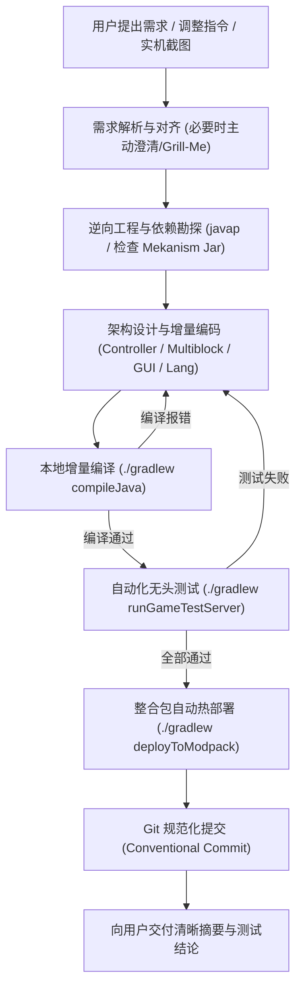

# Mekanism: Complex Industries - Agent 协作与工程研发工作流规范 (SOP)

> 本文档为参与 **Mekanism: Complex Industries (MCI)** 开发的 AI Agent 与分支子 Agent 提供的标准作业程序（Standard Operating Procedure）。旨在确立**“需求对齐 -> 逆向勘探 -> 原生适配 -> 验证闭环 -> 自动部署 -> 规范提交”**的高效工程研发范式。

---

## 目录
1. [核心原则与角色定位](#1-核心原则与角色定位)
2. [端到端研发全流程 (Workflow Lifecycle)](#2-端到端研发全流程)
3. [阶段详解与操作准则](#3-阶段详解与操作准则)
   - [第一阶段：需求解析与设计对齐](#第一阶段需求解析与设计对齐)
   - [第二阶段：Mekanism 逆向勘探与架构调研](#第二阶段mekanism-逆向勘探与架构调研)
   - [第三阶段：编码实施与原生风格对齐](#第三阶段编码实施与原生风格对齐)
   - [第四阶段：验证闭环（编译、无头测试与热部署）](#第四阶段验证闭环)
   - [第五阶段：版本控制与交付协议](#第五阶段版本控制与交付协议)
4. [核心子系统开发规范](#4-核心子系统开发规范)
   - [多方块结构 (Multiblock) 体系](#41-多方块结构-multiblock-体系)
   - [热力学与化学品管道交互](#42-热力学与化学品管道交互)
   - [Mekanism 原生 GUI 与警告系统 (Warning System)](#43-mekanism-原生-gui-与警告系统)
   - [JEI / REI 配方查看器适配](#44-jei--rei-配方查看器适配)
5. [Agent 避坑指南与研发军规](#5-agent-避坑指南与研发军规)

---

## 1. 核心原则与角色定位

在 MCI 项目中，人机配对编程的关系定位如下：
- **用户（User）**：**系统架构师 / 游戏产品负责人 (Product Owner)**。负责玩法设计、数值平衡、机制决策与最终体验验收。
- **Agent**：**资深全栈研发工程师 (Senior Implementation & QA Engineer)**。负责精准理解意图、逆向查验 Mekanism 底层源码、编写工业级可靠代码、执行自动化测试与打包部署。

### 核心行动原则：
1. **证据驱动，绝不臆测 API (Evidence-Based Implementation)**：
   Mekanism 1.21.1 架构复杂且频繁迭代，禁止凭通用记忆臆想类名或方法签名。必须通过 `javap`、反编译源码或本地依赖检查实际 API。
2. **原生一致性 (Native Aesthetic & Architecture Alignment)**：
   所有新增机器、方块、GUI、提示标签均需 100% 贴合 Mekanism 原版风格（如：黑底屏幕、灰度刻度仪表、黄黑警示条、侧边浮出标签页、平滑渐变速率条）。
3. **零退化与测试闭环 (Zero-Regression & Headless Test Loop)**：
   任何功能改动必须通过无头测试验证（`./gradlew runGameTestServer`），绝不将未经验证的代码交付给用户。
4. **敏捷响应与需求收敛 (Rapid Adaptation)**：
   当用户在实机测试中提出简化逻辑或调整 UI 时，立即响应并重构，不留废弃逻辑与代码包袱。

---

## 2. 端到端研发全流程



---

## 3. 阶段详解与操作准则

### 第一阶段：需求解析与设计对齐
- **输入特征**：用户可能提供一段机制描述、简短口令、实机操作疑问（例如“为什么右键没反应”）或一张游戏内截图。
- **处理准则**：
  1. **识别核心诉求**：提炼关键实体（方块、化学品、流体、多方块层级、GUI 部件）。
  2. **发现歧义时主动追问**：当核心数值公式、多方块成型边界或操作模式存在未定义行为时，先给出推荐选项并向用户对齐，严禁擅自做反常识的设计。
  3. **简化优先**：如果用户提出“逻辑太复杂了，改成单一进度/单一公式”，应当机立断废弃冗余逻辑，以最精炼健壮的状态机实现。

---

### 第二阶段：Mekanism 逆向勘探与架构调研
严禁凭空想象 Mekanism 的类结构。所有与 Mekanism 交互的代码必须先进行类结构查验：

#### 常用勘探命令：
```bash
# 1. 查找 Gradle 缓存中的 Mekanism 核心 Jar 包
find ~/.gradle/caches -name "*Mekanism*.jar" | grep -v sources

# 2. 使用 javap 查看特定类的方法签名与接口实现
javap -cp <MEK_JAR_PATH> mekanism.client.gui.element.gauge.GuiGauge

# 3. 勘探枚举、常量与错误代码
javap -cp <MEK_JAR_PATH> mekanism.common.inventory.warning.WarningTracker\$WarningType

# 4. 查看类构造方法（如 GUI 部件、进度条、标签页）
javap -cp <MEK_JAR_PATH> -c mekanism.client.gui.element.tab.GuiWarningTab
```

#### 勘探重点清单：
- **能力系统**：`IStrictEnergyStorage`, `IChemicalTank`, `IHeatCapacitor`。
- **多方块系统**：`MultiblockData`, `MultiblockManager`, `Structure`, `FormationProtocol`。
- **客户端 GUI**：`GuiElement`, `GuiGauge`, `GuiInnerScreen`, `GuiBar`, `GuiHeatTab`, `GuiWarningTab`。
- **配方查询**：`BaseRecipeCategory`, `initChemical`, `initFluid`, `RecipeIngredientRole`。

---

### 第三阶段：编码实施与原生风格对齐
1. **服务端与客户端严格分离**：
   - 严禁在 `MultiblockData` 或 `TileEntity` 等通用/服务端类中引用任何客户端类（如 `Screen`, `GuiElement`, `Minecraft.getInstance()`）。
   - 客户端专属内容一律放在 `.client.` 包下，并通过 `@OnlyIn(Dist.CLIENT)` 或标准事件解耦。
2. **多方块数据同步**：
   - 使用 Mekanism 原生的 `writeUpdateTag` 与 `readUpdateTag`，在状态、温度、负载速率或分层变化时触发同步。
3. **原生 GUI 部件组装**：
   - **尺寸计算**：标准 GUI 宽度 `176`（扩展宽屏多为 `226` 或 `206`），高度 `166`。
   - **内外边距**：组件间距通常保持 2~4px 留白。
   - **双语本地化**：每次在 GUI 或代码中新增 `Component.translatable` 时，**必须同步**在 `zh_cn.json` 和 `en_us.json` 两个文件中添加对应文本。

---

### 第四阶段：验证闭环

任何修改完成后，必须按顺序执行以下三步闭环：

#### 1. 编译验证
```bash
./gradlew compileJava
```
- 检查泛型推断（例如 `addRenderableWidget` 与 `warning` 的链式推断）。
- 确认零编译警告与零语法错误。

#### 2. 无头自动化测试 (GameTest)
```bash
./gradlew runGameTestServer
```
- 利用 NeoForge GameTest 在无图形界面的独立测试服务端中运行游戏测试。
- 保证已注册的所有测试用例（如多方块成型、催化裂解、管道阻断、接口切换）100% 通过（输出中必须包含 `All X required tests passed :)`）。

#### 3. 整合包热部署
```bash
./gradlew deployToModpack
```
- 项目中配置了自动化任务，可将最新编译出的 Jar 自动覆盖至玩家本地启动器的 mods 目录。
- 部署后告知用户无需重新打包，只需重启 Minecraft 客户端即可直接验收。

---

### 第五阶段：版本控制与交付协议
1. **工作区状态检查**：
   ```bash
   git status
   git diff
   ```
   仔细核对所有 modified 和 untracked 文件，杜绝无关临时文件污染。
2. **规范提交信息 (Conventional Commits)**：
   - 格式：`<type>(<scope>): <subject>`
   - 示例：
     - `feat(refinery): add JEI cracking recipe support and native output full warning tab`
     - `fix(refinery): fix resistive cooler and top cooling input valve interaction`
     - `refactor(multiblock): simplify cracking progress to single effective rate`
3. **交付摘要规范**：
   向用户汇报时，使用清晰的结构化 Markdown：
   - **改动内容**：分项列出解决的核心功能点。
   - **机制说明**：简明阐释涉及的数值与逻辑设计。
   - **测试与部署**：汇报 GameTest 与 deployToModpack 状态。

---

## 4. 核心子系统开发规范

### 4.1 多方块结构 (Multiblock) 体系
- **校验器 (`StructureValidator`)**：
  - 严格定义边界与框架方块限制（如尖棱处的方块限制、结构玻璃允许区间、分层隔板位置）。
  - 在接口右键/扳手交互时，若处于未成型状态需友好提示玩家成型后生效。
- **区域防刷怪与生态保护**：
  - 成型的多方块结构内部及紧邻区域应当禁止生物自然生成（利用 `MobSpawnSettings` 或事件监听）。
- **容量控制**：
  - 多方块内部化学品罐与热容值需按项目设定的比例缩放（如根据测试反馈缩小为标准值的 1/100 或 1/10）。

### 4.2 热力学与化学品管道交互
- **热量传导**：
  - 底层加热器与顶层制冷器应独立采用 `VariableHeatCapacitor` 模拟热容。
  - 使用 Mekanism 原生的对流与耗散公式（平方根耗散法则）。
- **化学品处理与连续累加**：
  - 浮点速率计算（如 `mB/s`）换算到 tick（`tick = rate / 20.0`），采用 `buffer` 累加器机制。
  - 只有当 `(long) buffer > 0` 且各产物槽均能接纳时才消耗输入并生成产物，避免截断误差损失物料。

### 4.3 Mekanism 原生 GUI 与警告系统
当产物槽满载或发生故障时，**严禁使用粗糙的自定义文本**覆盖原生机制，而应调用 Mekanism 内置的警告管线：
1. **仪表警告条纹绑定**：
   ```java
   outGauge.warning(WarningTracker.WarningType.NO_SPACE_IN_OUTPUT, () -> {
       RefineryMultiblockData multiblock = tile.getMultiblock();
       return multiblock.isFormed() && multiblock.outputTank != null && multiblock.outputTank.getNeeded() <= 0;
   });
   ```
   这会自动在仪表上方渲染黄黑斜向动态警戒斑马线。
2. **警示标签页 (`GuiWarningTab`)**：
   - 重写 `addWarningTab(IWarningTracker tracker)`。
   - 当左下角已有 `GuiHeatTab` 时，将警告标签页设置在右侧：
     ```java
     @Override
     protected void addWarningTab(IWarningTracker tracker) {
         addRenderableWidget(new GuiWarningTab(this, tracker, false)); // false 表示放置于右下角
     }
     ```

### 4.4 JEI / REI 配方查看器适配
1. **配方记录 (`*JEIRecipe`)**：使用 Java `record` 定义输入输出及描述文本组件。
2. **分类定义 (`*RecipeCategory`)**：
   - 继承 `BaseRecipeCategory<T>`。
   - 善用 `GuiInnerScreen`（设置 4 行规整短文，悬停提供详细机制说明）。
   - 添加与主 GUI 相同尺寸的速率条（`GuiHorizontalRateBar(this, RecipeViewerUtils.FULL_BAR, x, y)`）。
   - 使用 `initChemical` 与 `initFluid` 绑定输入与输出插槽，以便玩家快捷检索配方关联。
3. **插件注册 (`MCIJEIPlugin`)**：
   - 注册 Category、Recipe、Catalysts（多方块的所有相关方块均应加入催化剂）。
   - 注册主 GUI 的可点击区域（`addRecipeClickArea`）。

---

## 5. Agent 避坑指南与研发军规

| 编号 | 严重度 | 违规操作 (Anti-Pattern) | 正确做法 (Best Practice) |
| :--- | :--- | :--- | :--- |
| **#1** | **CRITICAL** | 臆测 Mekanism 内部方法并直接写代码 | 遇到不确定的类先用 `javap` 或查源码确认签名后再编码 |
| **#2** | **CRITICAL** | 未执行无头测试就声称“开发完成” | 每次交付前必跑 `./gradlew compileJava runGameTestServer` |
| **#3** | **HIGH** | 在服务端代码中直接引用客户端渲染类 | 严格遵守物理端隔离，通过网络数据包或 UpdateTag 同步数据 |
| **#4** | **HIGH** | 硬编码字符串显示在界面上 | 所有文字一律使用语言键，并同时写入 `zh_cn.json` 与 `en_us.json` |
| **#5** | **MEDIUM** | 在 GUI 中自创杂乱的错误提示文本 | 优先集成 Mekanism 原生的 `warning` 与 `GuiWarningTab` 机制 |
| **#6** | **MEDIUM** | 提交 git 时混入 IDE 缓存或测试临时文件 | 提交前必须执行 `git status` 审核改动清单 |

---

*文档维护者：TianYa & Antigravity AI Agent Team*  
*适用版本：Minecraft 1.21.1 / NeoForge 21.1.200 / Mekanism 10.7.19+*
