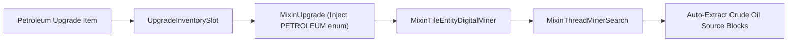

# Petrochemical & Cryogenic Process Ecology

> Industrial process chains, chemical reactions, thermodynamics, and factory automation in **Mekanism: Complex Industries (MCI)**.

---

## Table of Contents
1. [End-to-End Industrial Process Flow](#1-end-to-end-industrial-process-flow)
2. [World Generation & Resource Extraction](#2-world-generation--resource-extraction)
3. [Digital Miner Petroleum Upgrade (Mixin Integration)](#3-digital-miner-petroleum-upgrade-mixin-integration)
4. [Cryogenic Air Separation & Distillation](#4-cryogenic-air-separation--distillation)
5. [Chemical Solidification & Factory Tiers](#5-chemical-solidification--factory-tiers)
6. [Bitumen Road Engineering & Color System](#6-bitumen-road-engineering--color-system)
7. [Recipe Viewer Integrations (JEI & EMI)](#7-recipe-viewer-integrations-jei--emi)

---

## 1. End-to-End Industrial Process Flow

```mermaid
flowchart TD
    subgraph Upstream ["Upstream Extraction"]
        OilLake["Crude Oil Lakes (Worldgen)"]
        OilOre["Solid Crude Oil Ore & Deepslate"]
        Miner["Digital Miner + Petroleum Upgrade"]
        OilLake --> Miner
        OilOre -->|Enrichment Chamber / Smelter| SolidOil["Solid Crude Oil Item"]
        Miner --> CrudeOil["Crude Oil (Fluid / Chemical)"]
        SolidOil -->|Rotary Condensentrator| CrudeOil
    end

    subgraph Refining ["Midstream Thermal Cracking (Industrial Refinery)"]
        CrudeOil --> IRT["Industrial Refinery Tower (Delta T >= 100K, T >= 500K)"]
        IRT --> Gas["Petroleum Gas (2.0x)"]
        IRT --> Naphtha["Naphtha (0.2x)"]
        IRT --> Fuel["Refined Fuel (0.1x)"]
        IRT --> Heavy["Heavy Oil (0.1x)"]
        IRT --> Bitumen["Bitumen (0.15x)"]
    end

    subgraph Cryogenics ["Cryogenic Loop (Air Separation)"]
        AirComp["Air Compressor (5 FE/t)"] --> CompAir["Compressed Air (10 mB/t)"]
        ResCool["Resistive Cooler (Power -> Cryo)"] --> Freezer["Industrial Freezer (< -100°C)"]
        CompAir --> Freezer
        Freezer --> Nitrogen["Nitrogen"]
        Freezer --> NobleGas["Noble Gas"]
        Freezer --> Refrig["Cryogenic Refrigerant"]
    end

    subgraph Downstream ["Downstream Manufacturing"]
        Bitumen --> Solidifier["Chemical Solidifier / Factory Tiers"]
        Solidifier --> BitBlock["Bitumen Block (Raw Black)"]
        BitBlock -->|Stonecutter| SlabsStairs["Bitumen Stairs & Slabs"]
        BitBlock -->|Mekanism Painting Machine (Dyes)| DyedBlocks["16 Dyed Bitumen Blocks"]
        DyedBlocks -->|Stonecutter| DyedSlabsStairs["Dyed Stairs & Slabs (51 Total Blocks)"]
    end
```

---

## 2. World Generation & Resource Extraction

MCI seamlessly introduces natural hydrocarbon resources into Minecraft world generation:

### Crude Oil Lakes
- **Feature ID**: `crude_oil_lake`
- **Occurrence**: Surface and shallow subsurface biomes.
- **Fluid Mechanics**: High-viscosity dark crude fluid with custom flow physics and particle dissipation.

### Solid Crude Oil Ore & Deepslate Variant
- **Block IDs**: `solid_crude_oil_ore`, `deepslate_solid_crude_oil_ore`
- **Vein Generation**: Underground formations between $Y = -64$ and $Y = 64$.
- **Harvest Tool**: Iron Pickaxe or higher (`#minecraft:mineable/pickaxe`, `#minecraft:needs_iron_tool`).
- **Processing**:
  - Smelting $\rightarrow$ Solid Crude Oil (1:1)
  - Enrichment Chamber $\rightarrow$ Solid Crude Oil (1:2 doubled yield)
- **Item Fuel Value**: 3,200 burn ticks (smelts 16 items per solid crude oil lump).

---

## 3. Digital Miner Petroleum Upgrade (Mixin Integration)

MCI injects a custom upgrade type directly into Mekanism's core upgrade infrastructure using Mixin runtime bytecode transformation.

### Technical Implementation



- **Zero-Filter Extraction**: When installed in a Digital Miner, automatically searches and harvests all connected crude oil fluid sources within the defined radius without requiring item/tag filter entries.
- **Max Stack**: 1 Upgrade per Digital Miner.
- **Energy Penalty**: Balanced energy multiplier adhering to Mekanism upgrade mechanics.

---

## 4. Cryogenic Air Separation & Distillation

### Air Compressor
- **Type**: Single-block motorized air intake unit.
- **Energy Consumption**: $5\text{ FE/t}$ ($100\text{ FE/s}$).
- **Output Rate**: $10\text{ mB/t}$ ($200\text{ mB/s}$) of `Compressed Air`.
- **Intake**: Automatic passive ambient intake (no fluid pipes required for input).

### Resistive Cooler
- **Type**: High-efficiency electrical cryogenic heat sink.
- **Function**: Converts raw electrical energy directly into negative thermal delta.
- **Interface**: Direct thermal connection to adjacent multiblock casings.

### Industrial Freezer (Multiblock)
- **Dimensions**: $4 \times 4 \times 4$ to $8 \times 8 \times 8$ cubic enclosure.
- **Thermal Threshold**: Must be cooled below $-100.0^\circ\text{C}$ ($173.15\text{ K}$) to initiate cryogenic fractionation.
- **Process Outputs**:
  - **Nitrogen**: Ultra-pure industrial gas for inert atmosphere processes.
  - **Noble Gas**: Rare gaseous byproduct for advanced chemical synthesis.
  - **Cryogenic Refrigerant**: Closed-loop high-capacity coolant fluid.

---

## 5. Chemical Solidification & Factory Tiers

The **Chemical Solidifier** bridges fluid/chemical mechanics and physical item fabrication:


### Factory Tier Scalability
Like standard Mekanism machines, the Chemical Solidifier supports full factory tier progression:

| Tier | Block Name | Concurrent Channels | Power Buffer |
| :--- | :--- | :---: | :--- |
| **Standard** | `chemical_solidifier` | 1 Process Channel | Standard |
| **Basic** | `basic_chemical_solidifier_factory` | 3 Parallel Channels | $2\times$ Buffer |
| **Advanced** | `advanced_chemical_solidifier_factory` | 5 Parallel Channels | $4\times$ Buffer |
| **Elite** | `elite_chemical_solidifier_factory` | 7 Parallel Channels | $8\times$ Buffer |
| **Ultimate** | `ultimate_chemical_solidifier_factory` | 9 Parallel Channels | $16\times$ Buffer |

- **Factory Upgrades**: Install Speed, Energy, and Muffler upgrades across all channels.
- **Auto-Sorting**: Packet-driven output inventory sorting with custom network protocols.

---

## 6. Bitumen Road Engineering & Color System

MCI introduces 51 high-durability industrial road paving blocks:

### Material Properties
- Blast Resistance: Matches Blackstone ($6.0$).
- Hardness: $2.0$ (fast mining with pickaxe).
- Aesthetic: Seamless anti-skid dark aggregate finish.

### 16-Color Palette Matrix
Using the Mekanism Painting Machine with dyes, raw Bitumen Blocks can be dyed into 16 distinct safety and industrial roadway colors:

```text
White, Orange, Magenta, Light Blue, Yellow, Lime, Pink, Gray,
Light Gray, Cyan, Purple, Blue, Brown, Green, Red, Black
```

### Architectural Variations
Each of the 17 color options (raw + 16 dyed) features:
1. **Full Block**: High-speed highway paving and airport runways.
2. **Stairs**: Roadside curbing, drainage gullies, and overpass ramps.
3. **Slabs**: Smooth slope grading, pedestrian sidewalks, and lane dividers.

---

## 7. Recipe Viewer Integrations (JEI & EMI)

MCI provides first-class recipe visualization plugins:

- **JEI (Just Enough Items)**:
  - Custom categories for Industrial Refinery Cracking, Cryogenic Distillation, Air Compression, and Chemical Solidification.
  - Interactive temperature requirement tooltips ($<-100^\circ\text{C}$ and $>500\text{ K}$).
  - Full product warning explanations.
- **EMI**:
  - Native EMI Neoforge plugin with animated chemical gauges, dynamic arrow widgets, and tier-specific energy consumption data.
