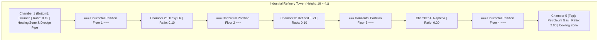
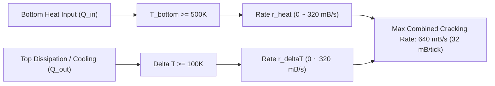

# Industrial Refinery Tower (IRT) Architecture & Engineering Specification

> Comprehensive mechanical, structural, and thermodynamic specification for the Industrial Refinery Tower multiblock in **Mekanism: Complex Industries (MCI)**.

---

## Table of Contents
1. [Structural Geometry & Footprint](#1-structural-geometry--footprint)
2. [Component Matrix & Block Taxonomy](#2-component-matrix--block-taxonomy)
3. [Fractionation Chamber Partitioning](#3-fractionation-chamber-partitioning)
4. [Thermodynamic Kinetics & Cracking Formulas](#4-thermodynamic-kinetics--cracking-formulas)
5. [Valve Control & Multi-Port I/O](#5-valve-control--multi-port-io)
6. [Safety Interlocks & Warning Systems](#6-safety-interlocks--warning-systems)
7. [Environmental Control & Spawn Suppression](#7-environmental-control--spawn-suppression)

---

## 1. Structural Geometry & Footprint

The Industrial Refinery Tower is an industrial-scale vertical fractional distillation column engineered to handle high-temperature thermal cracking of dense hydrocarbons into 5 distinct chemical fractions.

### Horizontal Cross-Section (7 × 7 Diamond Grid)
The horizontal cross-section is an octagonal/diamond grid occupying 25 active blocks per layer inside a 7×7 bounding volume:

```text
        dz = 0   1   2   3   4   5   6
  dx = 0     .   .   .  [W]  .   .   .
       1     .   .  [W!](I) [W!] .   .
       2     .  [W!](I) (I) (I) [W!] .
       3    [W] (I) (I) (M) (I) (I) [W]
       4     .  [W!](I) (I) (I) [W!] .
       5     .   .  [W!](I) [W!] .   .
       6     .   .   .  [W]  .   .   .

Legend:
  [W]  : Outer Tip Casings (dx=3 or dz=3, 4 blocks)
  [W!] : Diagonal Perimeter Casings (8 blocks)
  (I)  : Internal Chamber Cavity (12 blocks)
  (M)  : Central Column / Dredge Pipe (1 block, dx=3, dz=3)
  .    : Empty / Ignored Space Outside Boundary
```

### Vertical Constraints
- **Minimum Footprint**: $7 \times 7 \times 16$ (Height = 16 blocks)
- **Maximum Footprint**: $7 \times 7 \times 41$ (Height = 41 blocks)
- **Total Block Volume**: $25 \times H$ blocks (400 to 1,025 blocks)

---

## 2. Component Matrix & Block Taxonomy

| Block Name | Block Type | Role in Multiblock | Constraints |
| :--- | :--- | :--- | :--- |
| `refinery_controller` | Master Controller | Main logic, GUI screen, tick management | Exactly 1 per tower, outer wall |
| `refinery_casing` | Structural Frame | Hermetic high-pressure containment | Frame & solid base/top caps |
| `refinery_valve` | Dynamic I/O Port | Heat injection & chemical extraction | Outer wall, layer-specific routing |
| `refinery_dredge_pipe` | Core Conduit | Heavy sludge & slurry circulation | Center column at bottom layer (`dy=1`) |
| `structural_glass` | Inspection Window | Mekanism native glass observation panels | Wall non-edge positions only |

---

## 3. Fractionation Chamber Partitioning

The column internal volume is partitioned vertically into 5 progressive cracking chambers separated by 4 horizontal partition floors. The partition heights are dynamically calculated based on the total tower height $H$:



### Yield Stoichiometry (Per 1 mB Crude Oil Input)

$$\text{Crude Oil (1 mB)} \xrightarrow{\Delta T,\ \text{Heat}} \begin{cases}
2.00\text{ mB} & \text{Petroleum Gas (Top Fraction)} \\
0.20\text{ mB} & \text{Naphtha (Light Distillate)} \\
0.10\text{ mB} & \text{Refined Fuel (Medium Fuel)} \\
0.10\text{ mB} & \text{Heavy Oil (Heavy Distillate)} \\
0.15\text{ mB} & \text{Bitumen (Bottom Residue)}
\end{cases}$$

---

## 4. Thermodynamic Kinetics & Cracking Formulas

Processing speed is strictly governed by dual thermodynamic conditions: **Bottom Temperature ($T_{\text{bottom}}$)** and **Thermal Gradient ($\Delta T = T_{\text{bottom}} - T_{\text{top}}$)**.

### Operating Thresholds
- **Minimum Bottom Temperature**: $T_{\text{bottom}} \ge 500.0\text{ K}$ ($226.85^\circ\text{C}$)
- **Minimum Temperature Gradient**: $\Delta T = T_{\text{bottom}} - T_{\text{top}} \ge 100.0\text{ K}$

### Reaction Rate Equations

The effective cracking rate $r_{\text{effective}}$ (in $\text{mB/s}$) is calculated per tick:

$$r_{\text{heat}} = 320.0 \times \frac{\min(T_{\text{bottom}} - 500.0,\ 1500.0)}{1500.0}$$

$$r_{\Delta T} = 320.0 \times \frac{\min(\Delta T,\ 600.0) - 100.0}{500.0}$$

$$r_{\text{effective}} = \max\left(0.0,\ r_{\text{heat}} + r_{\Delta T}\right) \quad \left(0.0 \le r_{\text{effective}} \le 640.0\text{ mB/s}\right)$$



---

## 5. Valve Control & Multi-Port I/O

Valves dynamically bind to the fractionation chamber at their respective Y-level:

```text
Layer 5 (Top)    --> Valve Mode: Petroleum Gas Output
Layer 4          --> Valve Mode: Naphtha Output
Layer 3          --> Valve Mode: Refined Fuel Output
Layer 2          --> Valve Mode: Heavy Oil Output
Layer 1 (Bottom) --> Valve Mode: Bitumen Output / Crude Oil Input / Bottom Heat Input
```

- **Configurator Interaction**: Shift + Right-Click with a Mekanism Configurator toggles valve input/output routing.
- **Dynamic Textures**: Valve faceplate renders real-time port status and product chemical tinting.

---

## 6. Safety Interlocks & Warning Systems

The Refinery Multiblock incorporates a backpressure safety interlock:

1. **Capacity Monitoring**: Every tick, the controller calculates available space in all 5 output chemical tanks.
2. **Proportional Throttling**: If any single output tank becomes full:
   - Cracking rate immediately throttles to match the consumption rate of that saturated fraction.
   - If completely full, cracking halts ($r_{\text{effective}} = 0$).
3. **Mekanism Native Warning Tab**: The GUI displays an active warning tab:
   `"Cracking halts when any product tank is full"` with standard yellow/black warning hash marks.

---

## 7. Environmental Control & Spawn Suppression

Due to the extreme temperatures, hazardous gases, and mechanical scale of the refinery column:
- `RefinerySpawnHandler` hooks into NeoForge's entity spawn events.
- Hostile and passive mob spawning is 100% suppressed within the multiblock bounding box and in an extended safety envelope of 3 blocks around the structure perimeter.
